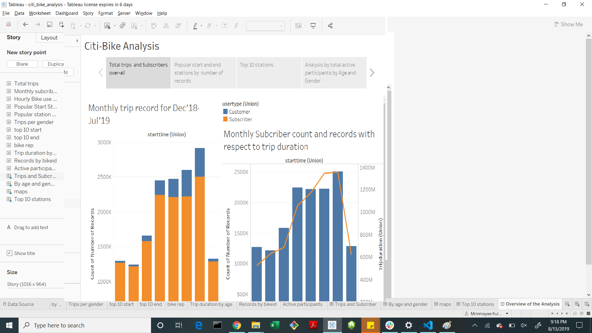
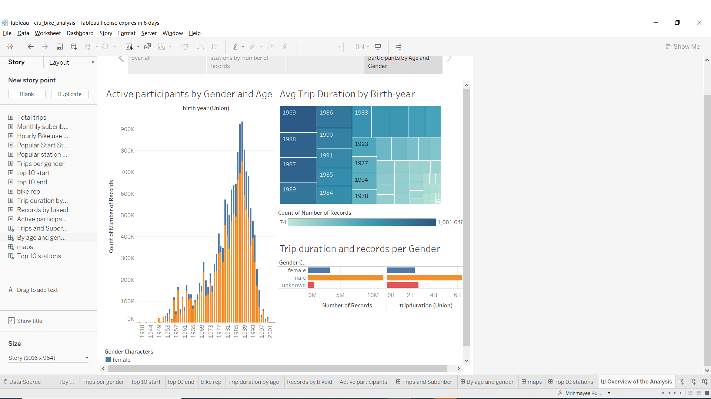

# Citi-Bike data analysis

This is an analysis of the Citi-bike data of New York City to show various aspects through Tableau Dashboards.

Creating Stories to explain the analysis by Station,BikeID,Gender etc.

The popular stations Start and End Stations can be seen in the above choropleth.

A Dashboard showing analysis of active participants by Gender and Age.
